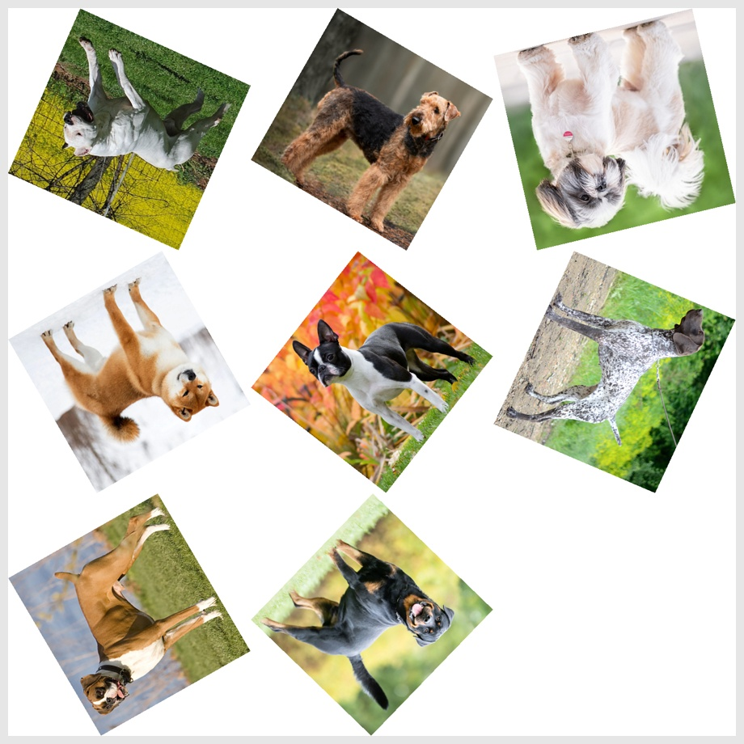

# Dobble Card Game Generator

Le **Dobble** (ou **Spot it!**) est un jeu de perception visuelle où chaque carte partage exactement **un unique symbole en commun** avec toutes les autres cartes. Ce projet permet de créer facilement votre propre jeu avec vos symboles !

## 📋 Table des Matières

- [Fonctionnalités](#-fonctionnalités)
- [Principe mathématique derrière le Dobble](#-principe-mathématique-derrière-le-dobble)
- [Utilisation](#-utilisation)
- [Exemple de rendu](#-exemple-de-rendu)

## ✨ Fonctionnalités

- Génération de jeux de cartes Dobble valides
- Personnalisation des symboles utilisés
- Visualisation et exportation des cartes

## 🧠 Principe mathématique derrière le Dobble

Le jeu Dobble repose sur une propriété très particulière : entre n'importe quelle paire de cartes, il doit y avoir exactement un unique symbole commun.

Ce problème, bien plus complexe qu’il n’y paraît, est lié aux plans projectifs finis, un concept issu des mathématiques combinatoires.
### 🌟 Comment ça fonctionne ?

    Chaque carte possède n symboles.

    Le nombre total de cartes doit être n² - n + 1.

    Le nombre total de symboles différents est également n² - n + 1.

Par exemple, avec 7 symboles par carte :

    Il y aura 57 cartes en tout.

    57 symboles différents à répartir.

La structure garantie que :

    Chaque paire de cartes partage exactement un symbole.

    Chaque symbole apparaît sur exactement n cartes.

### ⚙️ Les problématiques de création

Créer un tel jeu n'est pas trivial car :

    Il faut s'assurer que toutes les cartes respectent la propriété du symbole unique commun.

    Il faut trouver une organisation optimale des symboles pour éviter toute redondance ou erreur.

    En pratique, cela impose que n - 1 soit un nombre premier pour que la construction soit possible via des méthodes mathématiques simples (comme celle utilisant les plans projectifs finis).

 👉 Sans cette approche rigoureuse, il serait quasiment impossible de garantir manuellement que toutes les cartes respectent les règles du Dobble !

## 🚀 Utilisation

Clonez le dépôt :

```bash
git clone https://github.com/LylianChallier/PyDobble.git
cd PyDobble
```

Génerer un jeu de cartes valide :

```bash
python dobble_generator.py
```

Créer les cartes à partir des symboles stockés dans `images/*.png` et les mets dans `results/*.jpg` :
 ```bash
python dobble_creator.py
 ```

## 🖼️ Exemple de rendu

Voici un aperçu d'une carte générée :

<p align="center">
  
</p>
